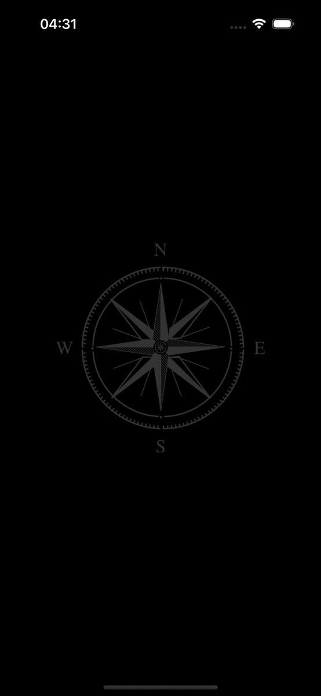
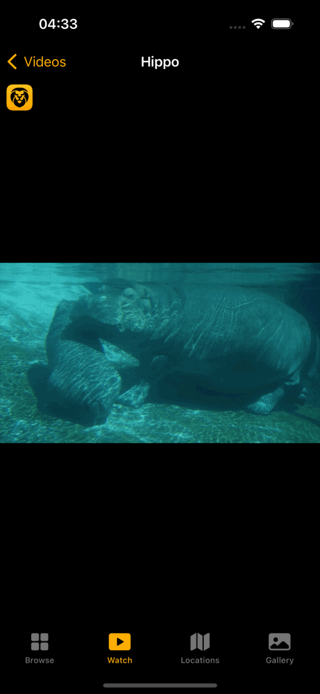
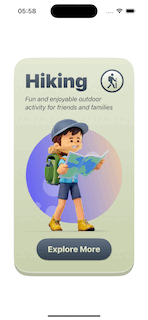
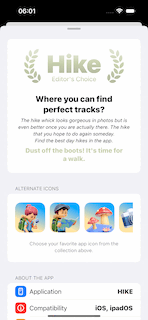
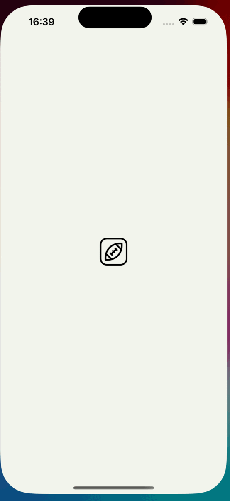
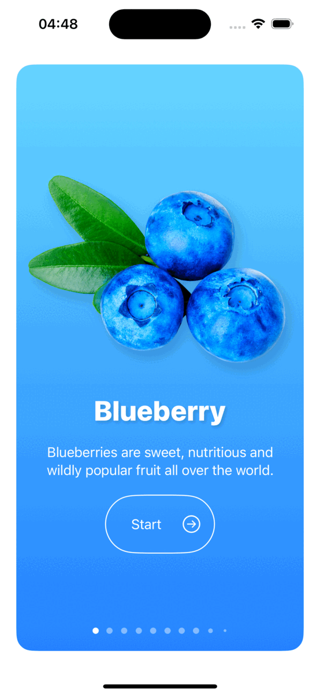
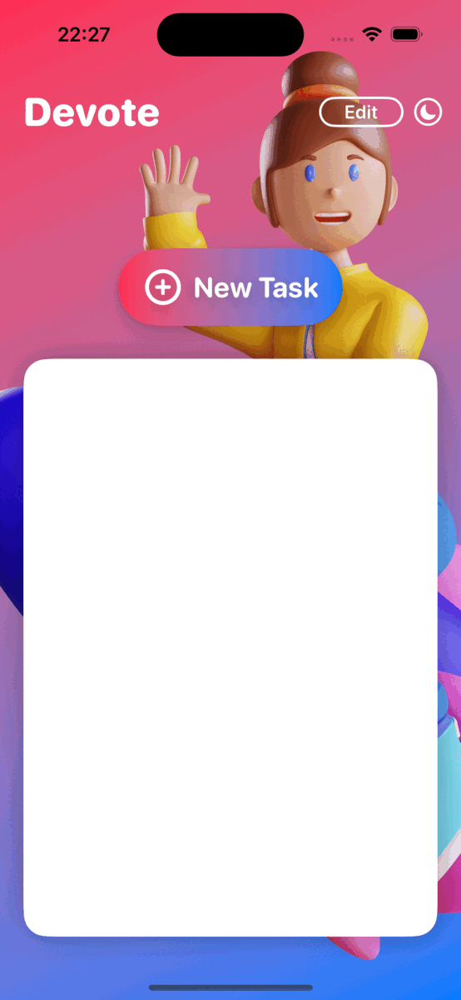

# SwiftUI-Masterclass
There are 7 projects developed with SwiftUI.

## Built With

- [Swift](https://developer.apple.com/swift/)
- [SwiftUI](https://developer.apple.com/xcode/swiftui/)

### Africa

  
  

### Hike

  
  

## TouchDown

   

## Restart

   

##  Pinch 

  

## Fructus

  

## Devote

  

